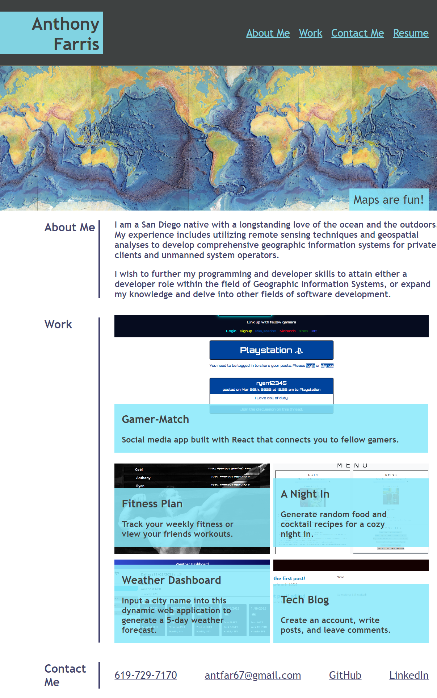

# <My Portfolio>

## Description

I created this application to preview some applications that I designed during my Full Stack Coding Boot Camp. I learned how to build a basic HTMl layout, resize elements with a responsive design, and integrate pseudoclasses into elements for user interaction.  

## Installation

N/A

## Usage

Instructions: 
1. Access the website at the provided URL: https://agarfar.github.io/my-portfolio/
2. Click the links at the top right of the page to browse the website content.
3. Hover over images of the listed applications in the "Work" section to highlight and bring them into focus. 
4. Click on an application to navigate to its webpage. 

The website should resemble the attached screenshot:

## Credits

N/A

## License

N/A